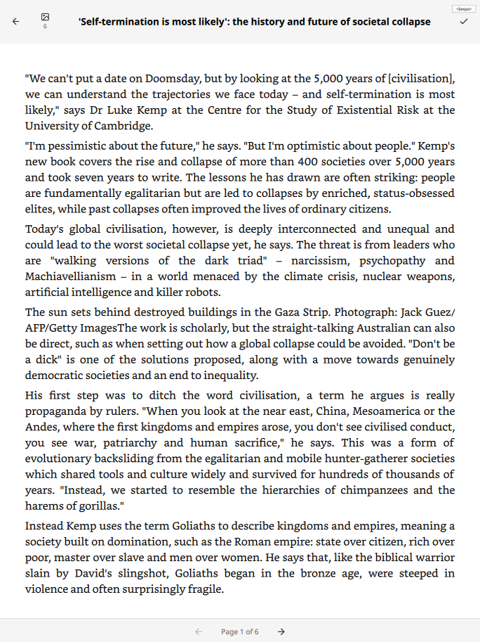
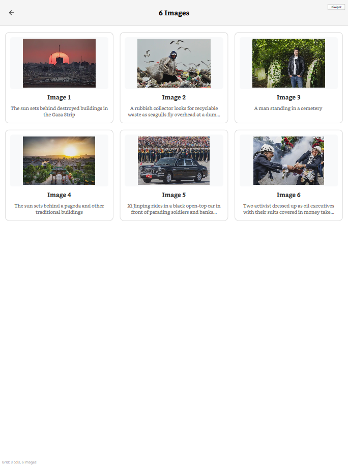

# RM-Readeck

This is a simple client for Readeck for the Remarkable Paper Tablet, using a QML front-end and and python backend.





The python backend is compiled to an executable using pyinstaller. The repo is a bit of a mess, and the build script assumes that you have:

- an rm-appload directory with a binary compiled for local development
- an aarch64 host to build a copy of the python executable that will run on the remarkable (paper pro, in this case)

If you just want to make it work on your device, install xovi and rm-appload to your device, along with qt-resource builder, then copy the dist-local folder to your device and into /root/xovi/exthome/rm-appload/, rename the folder to 'rm-readeck' and create a file in the home directory called .rm-readeck with your server credentials in this format:

It should then show up in RM-Appload.

```
READECK_API_KEY="AD8mpt7vRfjDD9MQdwvb5N7nLSYSs4SkyXG8jBC5MgQEyjCk"
READECK_URL="https://readeck.helios.red"
```

TODO:

[] Allow marking as read / archiving